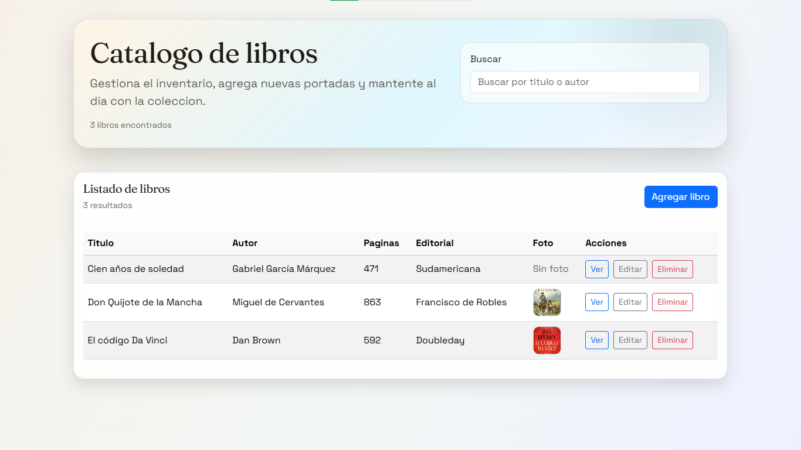
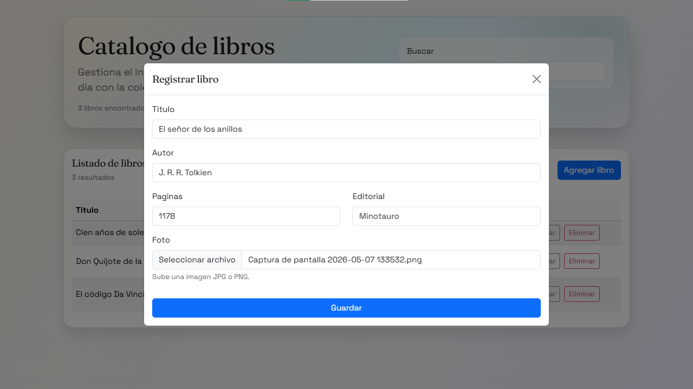
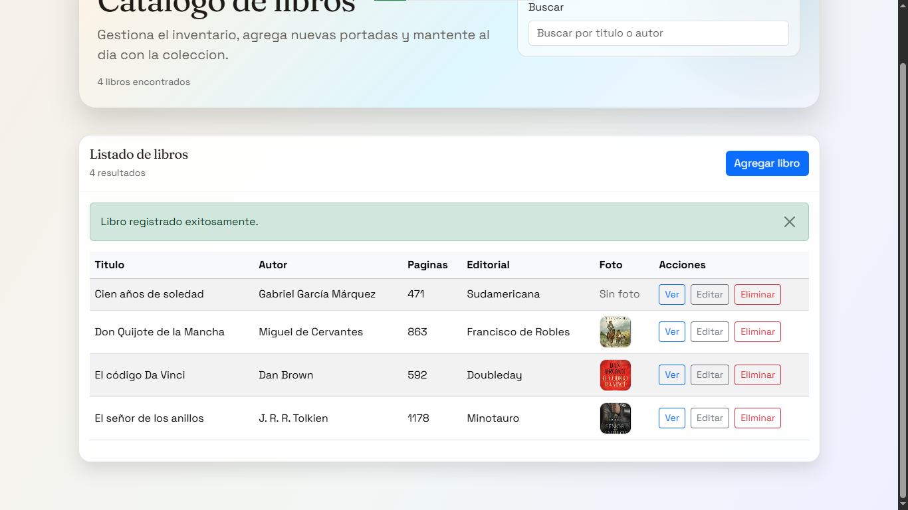
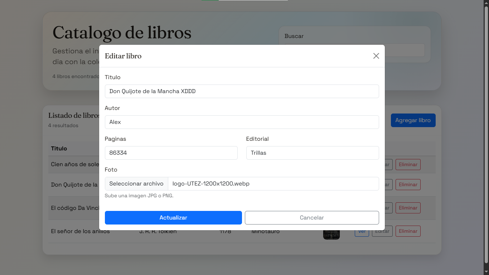
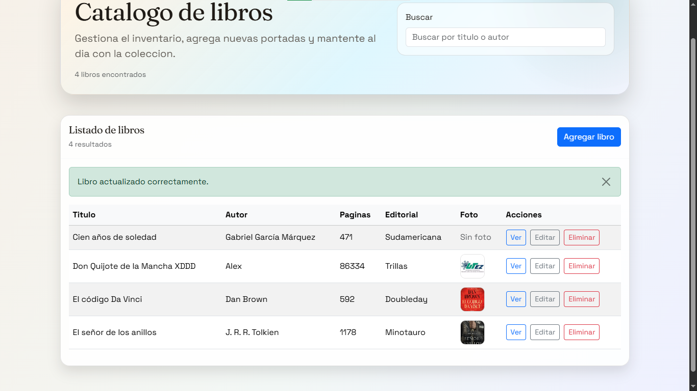
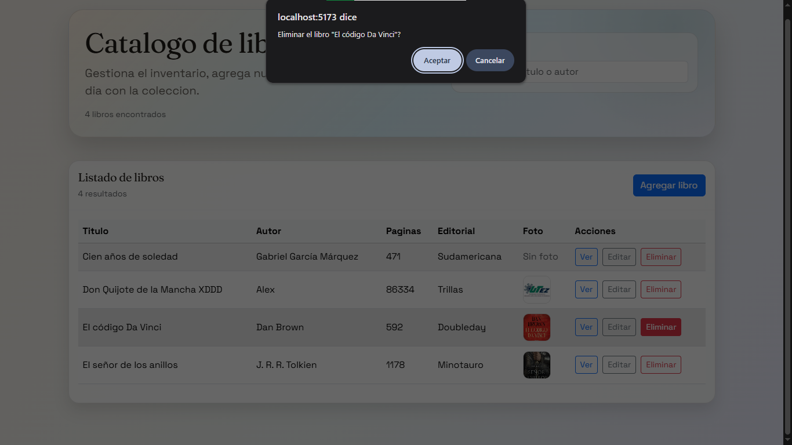
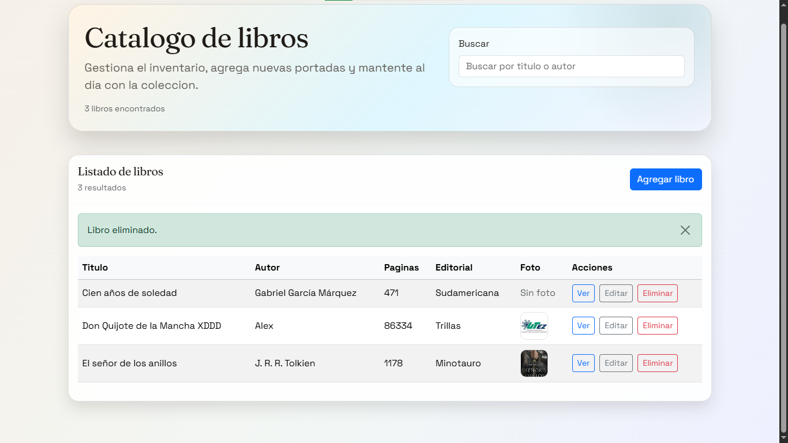

# Sistema-de-biblioteca

## Descripcion

Sistema web de biblioteca diseñado para gestionar libros. Está hecho en backend con Django REST Framework y en el frontend con React.

## Tecnologias utilizadas

- Backend: Django, Django REST Framework, drf-spectacular, django-cors-headers, MySQL, python-decouple, Pillow
- Frontend: React, Vite, Bootstrap, Axios

## Funcionalidades

- CRUD de libros (crear, listar, editar, eliminar)
- Carga y visualizacion de imagenes para cada libro
- Busqueda por titulo o autor
- Vista de detalle en modal

## Instrucciones para ejecutar el proyecto

Se consulta en la guia completa en [INSTALACION.md](INSTALACION.md).

## Evidencias o capturas de pantalla

A continuación se muestran evidencias con capturas de pantalla de las operaciones CRUD del sistema de biblioteca:

	
Listado de libros

	

	Descripcion: pantalla principal con listado, busqueda y boton de agregar para libros.

	
Modal de registro de libros

	

	Descripcion: formulario para crear un nuevo libro.

	
Libro agregado correctamente

	

	Descripcion: Muestra cuando es agregado un nuevo libro al catálogo.

	
Modal de edición de libros

	

	Descripcion: formulario para actualizar la información de un libro.

	
Libro actualizado correctamente

	

	Descripcion: Muestra cuando es actualizado un libro correctamente.

	
Alert de eliminación de un libro

	

	Descripcion: Alerta de advertencia cuando se va a eliminar un libro.

	
Libro eliminado correctamente

	

	Descripcion: Muestra cuando es eliminado un libro correctamente.

## Uso de IA

A continuación se detallan las IAs que fueron ocupadas en el desarrollo de este proyecto y el motivo por el cual se utulizaron.

- Claude: Fue usada principalmente para el análisis y planificación tanto de la estructura del backend asi como del frontend. Gracias a esto se pudo tomar la mejor desición acerca de la estructura más optima que le convendría al proyecto, haciendolo de esta manera un poco mas escalable. Tambien se ocupó para la implementacion de ciertas piezas con un desarrollo pequeño, como lo pudo ser el interceptor de Axios, los componentes reutlizables de botones, tablas, etc. Además ayudó en la creación del archivo de instalación del proyecto.
- Gemini: Se utilizó para el diseño incial de la vista de todos los libros, evaluando las distintas alternativas que la IA oferecía para obtener el diseño mas agradable visualmente.
- GitHub Copilot: Fué de gran ayuda en la generacion de logica para componentes mas complejos, como lo fué el hook que gestiona toda la lógica CRUD de libros y ajustes de UI de bugs que surgieron al implementar el diseño visual propuesto por GEMINI.